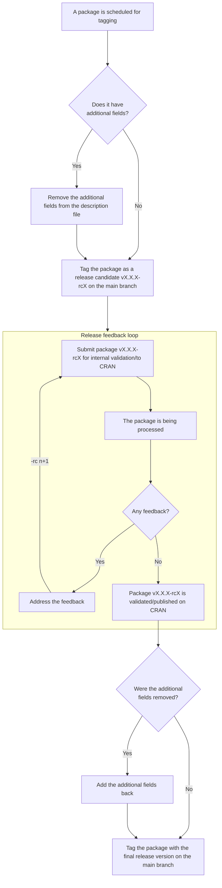

# Release Decision Tree

```mermaid
flowchart TB
A[A package is scheduled for tagging] ---> B
    B{<br>Does it have</br>additional fields?</br>}
    B --->|Yes| C1[Remove the additional fields from the description file]
    B --->|No| C2[Tag the package as a release candidate vX.X.X-rcX on the main branch]
    C1 ---> C2
    C2 ---> D
        subgraph D [Release feedback loop]
        X1[Submit package vX.X.X-rcX for internal validation/to CRAN]
        X1 --->X2[The package is being processed]
        X2 --->X3{Any feedback?}
        X3 --->|Yes| Y1[Address the feedback]
        X3 --->|No| X4[Package vX.X.X-rcX is validated/published on CRAN]
        Y1 --->| -rc n+1|X1
    end
    X4 -->F{<br>Were the additional</br>fields removed?</br>}
    F --->|Yes| G1[Add the additional fields back]
    F --->|No| G2[Tag the package with the final release version on the main branch]
    G1 --->G2
```
